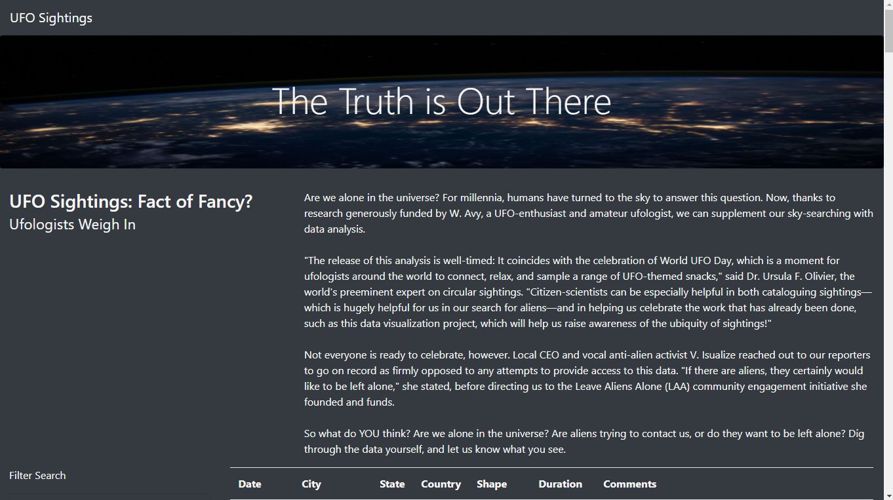

# UFOs (The Truth is out there)
---

**Summary**
---

Dana’s webpage and dynamic table are working as intended, but she’d like to provide a more in-depth analysis of UFO sightings by allowing users to filter for multiple criteria at the same time. In addition to the date, I added table filters for the city, state, country, and shape.

**Goals**
---

This new assignment consists of one technical analysis deliverable and a written report. You will submit the following deliverables:

-Deliverable 1: Filter UFO sightings on multiple criteria

-Deliverable 2: A written report on the UFO analysis (README.md)

**Languages**
---

1. Javascript ES6 standard
2. D3.js
3. Boostrap 4 (Mobile first) instead of Boostrap 3 (Desktop first)
4. CSS3 
5. HTML5

**Resources**
--
1. [app2.js](static/js/app2.js)
2. [index.html](index.html) 
3. [data.js](static/js/data.js) 
4. [style.css](static/css/style.css) 

**Screenshots**
---

**Desktop View**

**Search Criteria**

**Ipad View**

